# Homework 2 - Regression and Classification Error Analysis

**Student:** טדי רבליס 
**Student ID:** 313261919 
**Dataset:** Hugging Face Models Trending

This Markdown report presents the complete submission in the order of the assignment. The executable source, full outputs, and calculations are preserved in `notebooks/huggingface_models_error_analysis.ipynb`.

## 1. Dataset and problem formulation

The frozen Homework 1 dataset contains 156,000 daily observations and 13 original columns. Each row describes a trending Hugging Face model at a particular snapshot date, including downloads, likes, creation and update dates, task, library, tags, and access status.

The modeling frame uses the latest snapshot, July 30, 2026, which contains exactly 1,000 unique model IDs. This avoids treating repeated observations of the same model as independent samples.

- **Regression target:** `downloads`.
- **Classification target:** `is_gated`, where `manual` and `auto` are gated and `FALSE` is not gated.
- **Gated observations:** 44 of 1,000, or 4.4%.
- **Dataset SHA-256:** `A74C74F76E7FDF3095861AFA3F52484ACE9C1B6EDD83B24B66F87BAA9DDD2966`.

### Engineered features

- `model_age_days`: days between model creation and the snapshot.
- `days_since_update`: days between the last update and the snapshot.
- `tag_count`: number of tags attached to the model.
- Missing `library_name` values are retained as an explicit `missing` category.

Identifiers, free-text tags, the completely missing `license` column, and the constant `private` column are excluded from modeling.

## 2. Cross-validation design

All results use **5-fold cross-validation**.

- Regression uses shuffled `KFold` with approximately 800 training and 200 validation rows in every fold.
- Classification uses shuffled `StratifiedKFold`. Each validation fold contains approximately 8-9 gated examples.
- Preprocessing is fitted separately inside every fold.
- Every reported prediction is out-of-fold: an observation is never predicted by a model trained on that observation.
- Random seed `42` is used for reproducibility.

Five folds provide a practical bias-variance compromise. Ten folds would leave only four or five gated examples in each classification validation fold and would make minority-class estimates less stable.

## 3. Regression models

All regression models use the same feature set. Because downloads are strongly right-skewed, the models learn `log1p(downloads)` and automatically transform predictions back into original download units.

### Models and hyperparameters

1. **Linear Regression:** ordinary least squares baseline with scaled numeric features.
2. **Decision Tree Regressor:** `max_depth=10`, `min_samples_leaf=8`.
3. **Random Forest Regressor:** 180 trees, `max_depth=16`, `min_samples_leaf=3`, `max_features=0.75`.
4. **KNN Regressor - bonus:** 15 neighbors, distance weighting, Euclidean distance, scaled inputs.

### Out-of-fold regression results

| Model | MAE | MSE | RMSE | R2 | Fold RMSE SD |
|---|---:|---:|---:|---:|---:|
| Random Forest | 1,873,999.98 | 9.4809e13 | 9,737,001.07 | 0.0755 | 7,263,313.55 |
| Decision Tree | 2,057,339.23 | 9.7133e13 | 9,855,603.36 | 0.0529 | 7,236,446.97 |
| KNN - bonus | 1,960,761.26 | 1.0189e14 | 10,094,301.05 | 0.0064 | 7,463,382.67 |
| Linear Regression | 2,567,832.79 | 3.8865e14 | 19,714,084.67 | -2.7897 | 15,891,607.52 |

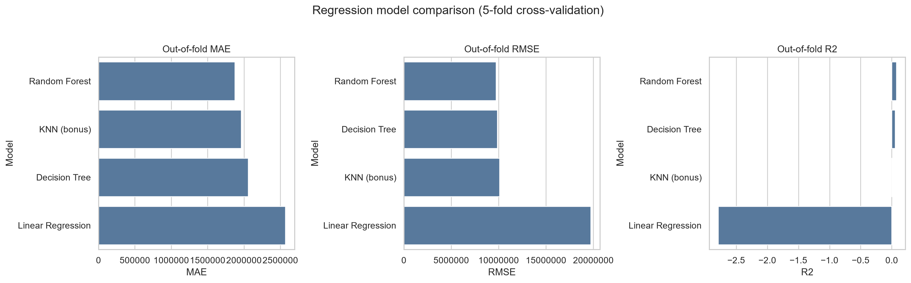

### Regression model discussion

**Random Forest is the preferred model.** It achieves the lowest MAE and RMSE and the highest R2. Its R2 remains low, which is an important finding rather than a result to hide: likes, age, update recency, tags, task, library, and access status explain only a limited portion of the extreme variation in downloads.

- Linear Regression has the highest structural bias and cannot express threshold effects or feature interactions.
- A single tree captures nonlinear regions but has higher variance.
- Random Forest reduces tree variance by averaging many learners.
- KNN is sensitive to scaling, sparse neighborhoods, and the geometry created by one-hot categories.
- The log target reduces the training influence of download outliers, while original-scale metrics preserve their real practical cost.
- External traffic, deployment integrations, organization resources, product usage, and sudden media events are absent from the dataset.

## 4. Regression error analysis

For each observation, the residual is:

`residual = actual downloads - predicted downloads`

Positive residuals are under-predictions. Negative residuals are over-predictions.

### 4.1 Residuals as a function of predictions

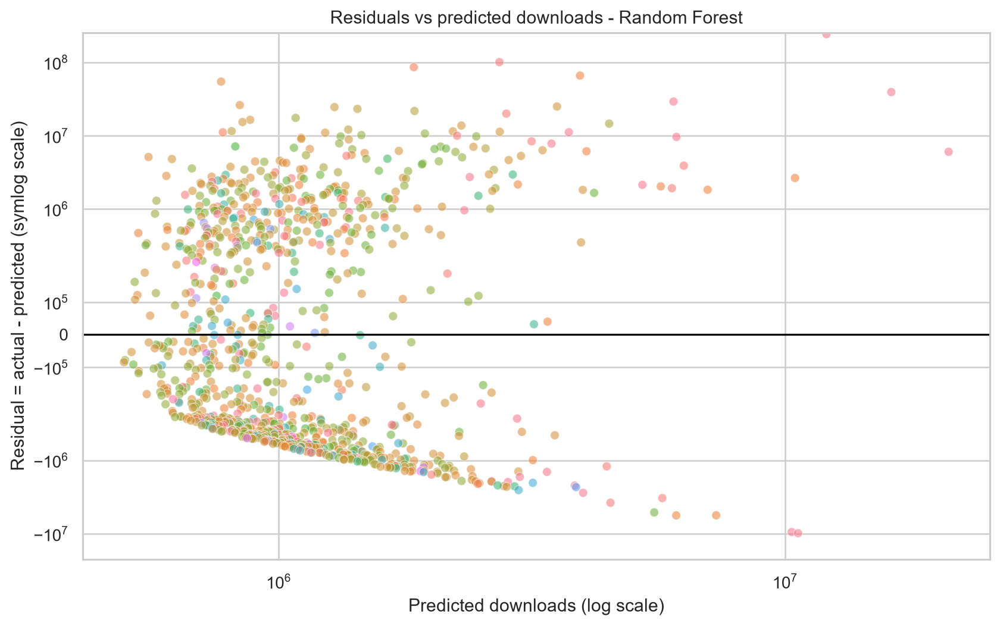

- **Are residuals centered around zero?** The mean residual is 1,222,514 downloads. The positive value indicates systematic under-prediction on the original scale, driven mainly by a small number of blockbuster models.
- **Systematic patterns:** the residual cloud widens with predicted downloads. Exceptional models form a large positive tail.
- **Heteroscedasticity:** yes. Error variance grows with model popularity, so the constant-variance assumption is not satisfied.
- **High-error sectors:** among sectors containing at least ten models, `text-ranking` has the highest mean absolute error. `sentence-similarity` and `fill-mask` also contain large-error observations.

### 4.2 Residual distribution

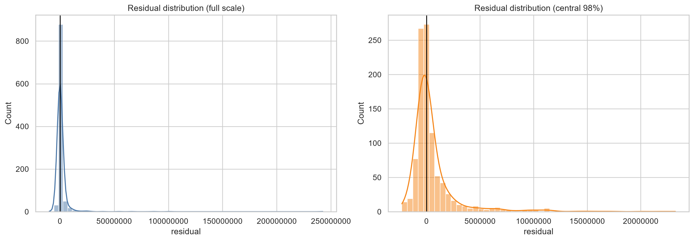

The full-scale histogram is dominated by a small number of extreme positive residuals. The central-98% view shows that the main mass is much closer to zero but remains asymmetric.

### 4.3 Error as a function of features

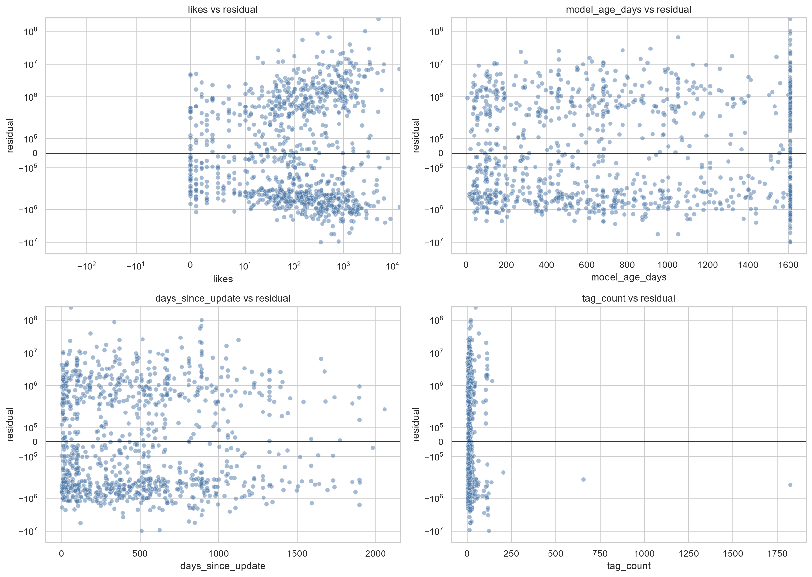

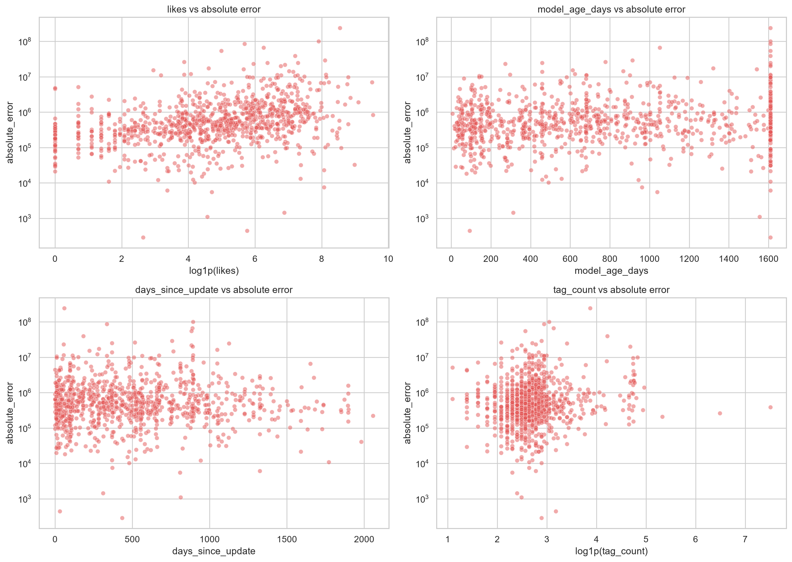

- Absolute error generally grows with `likes`, a proxy for model scale.
- Model age and update recency contain overlapping subpopulations rather than one global linear pattern.
- `tag_count` is concentrated at low values; a small number of highly tagged models form sparse regions.
- The plots support nonlinear and feature-dependent error behavior.

### 4.4 Extreme errors

The top 5% absolute-error cutoff is **6,137,024 downloads**. Exactly 50 observations meet or exceed this cutoff.

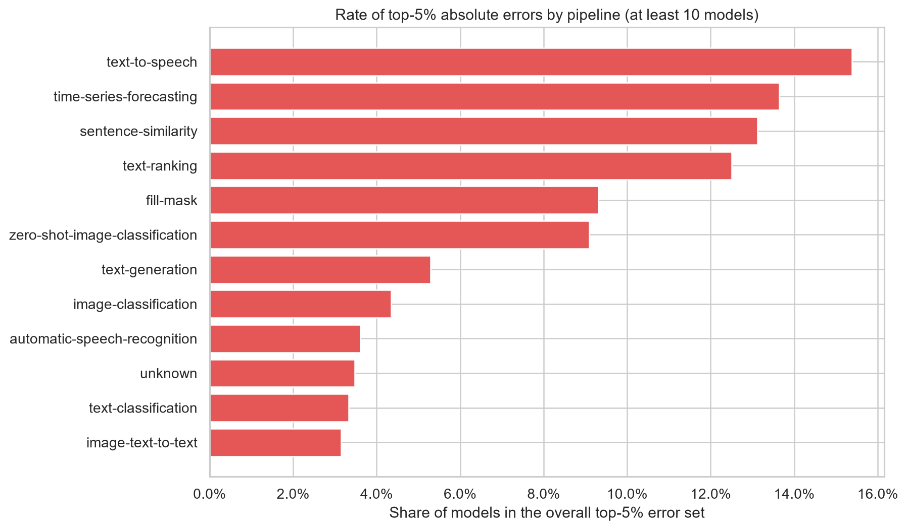

The individual extreme observations are displayed in the executable notebook with model ID, pipeline, library, actual value, prediction, residual, absolute error, and a transparent likely-source label.

The errors arise from a combination of:

- **Data quality:** missing library metadata removes technical context.
- **Model limitations:** the available features omit external deployment and traffic effects.
- **Rare cases:** blockbuster models and rare pipeline categories lie in sparsely represented regions.
- **Formulation:** the dataset contains only trending models, so the modeling population is already selected by popularity.

### 4.5 Statistical properties of residuals

| Statistic | Value |
|---|---:|
| MAE | 1,873,999.98 |
| Mean residual | 1,222,514 |
| Residual standard deviation | 9,664,784 |
| Residual skewness | 18.032 |
| Residual excess kurtosis | 408.629 |
| 95th-percentile absolute error | 6,137,024 |

The very large positive skewness and excess kurtosis demonstrate a heavy right tail. This indicates instability caused by exceptional under-predictions and confirms that average metrics alone are insufficient.

## 5. Classification models

All classification models use the same features: downloads, likes, model age, update recency, tag count, pipeline, and library.

### Models and hyperparameters

1. **Logistic Regression:** `C=1`, balanced class weights, maximum 3,000 iterations.
2. **Decision Tree Classifier:** `max_depth=8`, `min_samples_leaf=6`, balanced class weights.
3. **Random Forest Classifier:** 240 trees, `max_depth=14`, `min_samples_leaf=3`, `max_features=0.75`, balanced-subsample weights.

### Out-of-fold classification results at threshold 0.5

| Model | ROC-AUC | Average Precision | Precision | Recall | F1 | MCC | Balanced Accuracy | Fold AUC SD |
|---|---:|---:|---:|---:|---:|---:|---:|---:|
| Random Forest | 0.8913 | 0.5574 | 0.6923 | 0.4091 | 0.5143 | 0.5165 | 0.7004 | 0.0640 |
| Decision Tree | 0.7241 | 0.3564 | 0.1742 | 0.5227 | 0.2614 | 0.2476 | 0.7044 | 0.0641 |
| Logistic Regression | 0.8322 | 0.2593 | 0.1976 | 0.7500 | 0.3128 | 0.3353 | 0.8049 | 0.0972 |

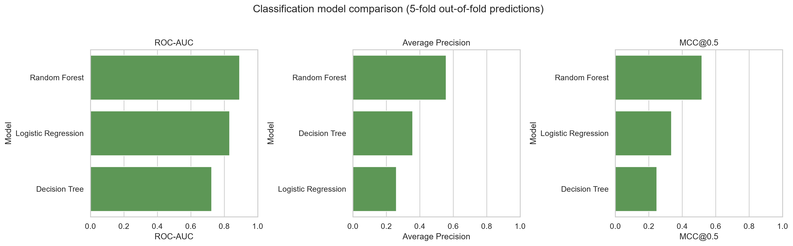

**Random Forest is the preferred classifier.** It has the highest out-of-fold ROC-AUC and average precision. Accuracy is not used for model selection because predicting every example as not gated would already achieve 95.6% accuracy.

## 6. Classification error analysis

### 6.1 Confusion matrix

False negatives are considered more critical in this context. A false negative predicts that a gated model is unrestricted, which can break an automated download or deployment workflow. A false positive creates extra caution or manual review but does not incorrectly promise access.

The recommended threshold is **0.2**, selected from out-of-fold predictions by maximum F2, which gives recall more weight than precision.

| Outcome | Count |
|---|---:|
| True negatives | 889 |
| False positives | 67 |
| False negatives | 12 |
| True positives | 32 |

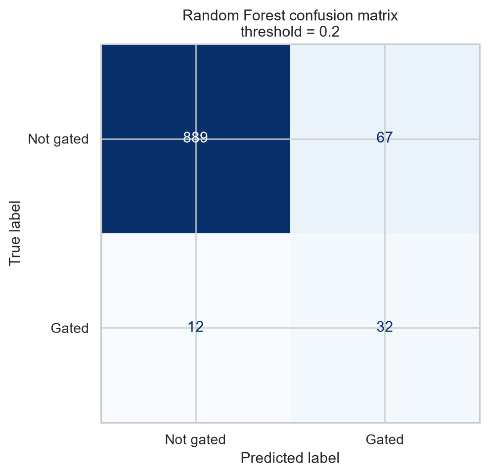

At this threshold, 32 of the 44 gated models are detected. The price of higher recall is 67 false-positive reviews.

### 6.2 Probability-based analysis

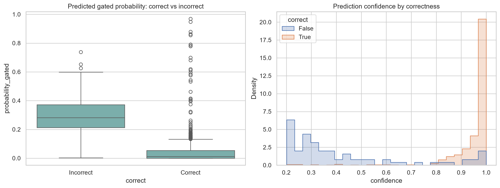

Correct predictions are usually more decisive, but the distributions overlap. There are **12 high-confidence errors** with confidence of at least 0.80. These errors are important because they reveal confident model failure rather than simple boundary uncertainty.

### 6.3 Error as a function of features

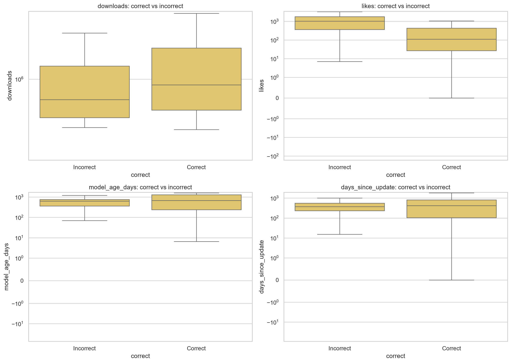

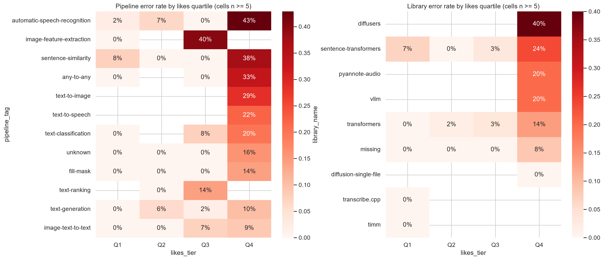

- Misclassification varies across pipeline and download-tier combinations.
- Sparse task regions can have very high observed error rates.
- Heatmap cells are included only when they contain at least five models, reducing conclusions based on isolated observations.
- Downloads and likes differ between correct and incorrect groups, but their distributions overlap substantially.

### 6.4 Threshold sensitivity

| Threshold | Precision | Recall | F1 | F2 | MCC | Predicted positives |
|---:|---:|---:|---:|---:|---:|---:|
| 0.1 | 0.1777 | 0.7955 | 0.2905 | 0.4692 | 0.3228 | 197 |
| 0.2 | 0.3232 | 0.7273 | 0.4476 | 0.5818 | 0.4513 | 99 |
| 0.3 | 0.4333 | 0.5909 | 0.5000 | 0.5508 | 0.4796 | 60 |
| 0.4 | 0.5641 | 0.5000 | 0.5301 | 0.5116 | 0.5109 | 39 |
| 0.5 | 0.6923 | 0.4091 | 0.5143 | 0.4455 | 0.5165 | 26 |
| 0.6 | 0.8125 | 0.2955 | 0.4333 | 0.3385 | 0.4778 | 16 |
| 0.7 | 0.9000 | 0.2045 | 0.3333 | 0.2419 | 0.4195 | 10 |
| 0.8 | 1.0000 | 0.1136 | 0.2041 | 0.1381 | 0.3304 | 5 |
| 0.9 | 1.0000 | 0.0455 | 0.0870 | 0.0562 | 0.2087 | 2 |

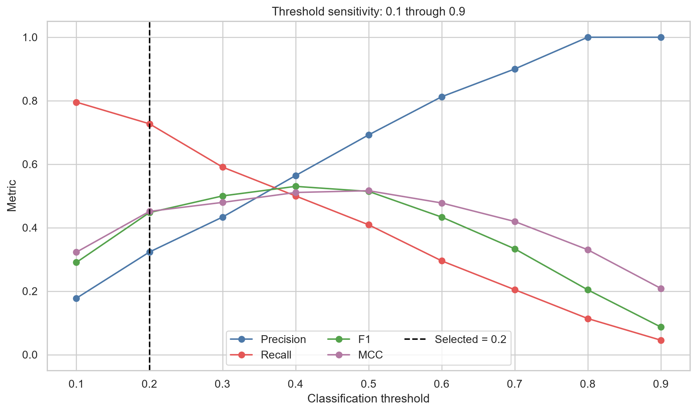

Lower thresholds improve recall but create more false positives. Higher thresholds improve precision but miss more gated models. The F2-based operating threshold of 0.2 provides recall of 0.7273 and the best observed F2 of 0.5818.

### F-beta as a function of beta

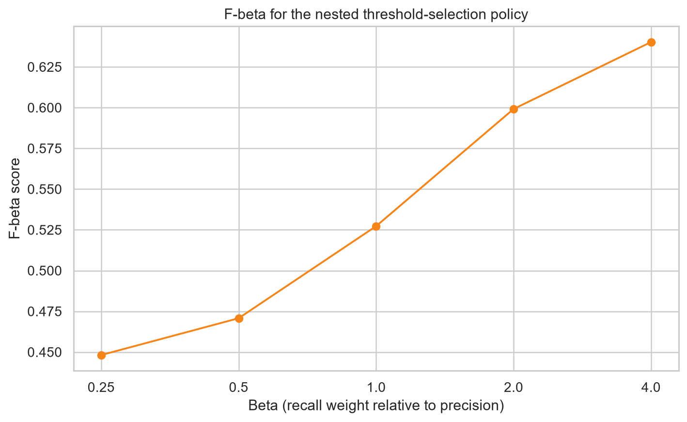

Beta below 1 emphasizes precision. Beta above 1 emphasizes recall. The rising curve shows that the threshold-0.2 predictions are better aligned with recall-sensitive applications than with precision-sensitive applications.

### ROC-AUC

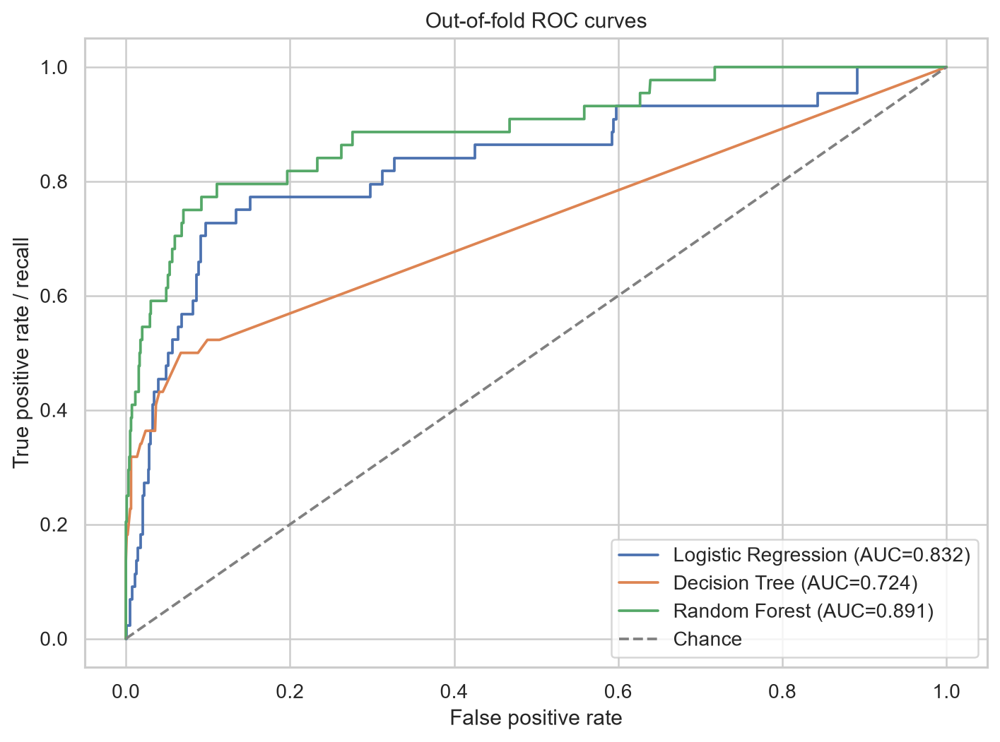

The preferred Random Forest achieves an out-of-fold ROC-AUC of 0.8913. ROC-AUC measures ranking across thresholds; average precision is also reported because it is more sensitive to the rare gated class.

## 7. Critical discussion

### Strengths and limitations

- Linear and logistic models provide transparent baselines but impose additive relationships.
- Trees capture nonlinear thresholds and interactions.
- A single tree has higher variance; Random Forest improves stability through averaging.
- Random Forest provides the best overall performance but is less interpretable.
- The trending-only sample does not represent the complete Hugging Face Hub.
- The gated class is rare, making classification metrics and threshold choice sensitive to a small number of cases.

### Model assumptions and observed behavior

- Independence is improved by using one latest-snapshot row per model.
- Regression residuals are not normal or homoskedastic on the original scale.
- Linear relationships are insufficient for the regression task.
- Logistic Regression ranks gated models reasonably well but produces many positives when balanced class weights are used.
- Tree-based methods are advantageous when task, library, popularity, age, and recency interact through thresholds.

### Recommended improvements

1. Add leakage-safe longitudinal growth features from earlier snapshots.
2. Retrieve missing library and license metadata from authoritative model cards or the Hugging Face API.
3. Add model size, organization, deployment, and external-traffic indicators.
4. Use nested cross-validation for hyperparameter and threshold selection.
5. Calibrate classification probabilities.
6. Define an explicit cost matrix for false positives and false negatives.
7. Collect more gated examples and validate performance separately by task and library.

## 8. Final reflection

1. **Where does the model fail most?** Regression fails most on blockbuster models and sparse pipeline sectors. Classification fails in underrepresented task and popularity regions.
2. **Are failures due to data, model, or formulation?** All three. Missing and omitted variables are data limitations; linearity and local sparsity are model limitations; the trending-only sample and binary gated target are formulation choices.
3. **What improvements are proposed?** Leakage-safe time features, authoritative metadata repair, nested tuning, calibration, explicit error costs, and additional gated observations.
4. **What insights were gained?** Aggregate metrics hide structured failures. Minority-class behavior, residual tails, fold stability, and the operating threshold determine whether a model is reliable in practice.

## Submission files

- `HOMEWORK_2_REPORT.md` - this complete Markdown report.
- `OPEN_QUESTIONS.md` - concise numerical answers.
- `ASSIGNMENT_CHECKLIST.md` - requirement-by-requirement mapping.
- `QA_REPORT.md` - execution and visual-verification evidence.
- `REVIEW_GUIDE.md` - recommended review order.
- `../notebooks/huggingface_models_error_analysis.ipynb` - executable notebook with embedded outputs.
